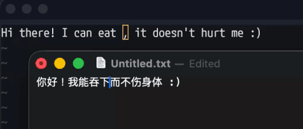

# clavy

`clavy` (formerly `claveilleur`) is a simple input source switching daemon for macOS.

## About

Inspired by a native Windows functionality, `clavy` can automatically switch the current input source for you according to the current application (rather than the current document).

This is especially useful for polyglot users who often need to switch between languages depending on the application they are using
(e.g. using English for coding in VSCode and Chinese for writing emails in Safari).



## Status

The author of this project has been daily-driving the daemon since 2023.
Thus, it can be considered ready for everyday use.

## Building & Installation

### Installing with `brew`

```sh
brew install rami3l/tap/clavy
```

### Building from source

```sh
# Live on the bleeding edge
cargo install clavy --git=https://github.com/rami3l/clavy.git
```

## Usage

Getting started is as simple as:

```sh
# Installs the launch agent under `~/Library/LaunchAgents`
clavy install

# Starts the service through launchd
clavy start
```

If this is your first time using `clavy`, please note that you might need to grant necessary privileges through `System Settings > Privacy & Security > Accessibility`.
After doing so, you might need to stop the service and start it again for those changes to take effect:

```sh
# Restarts the service through launchd
clavy restart
```

To uninstall the service, you just need to run the following:

```sh
# Stops the service through launchd
clavy stop

# Removes the launch agent from `~/Library/LaunchAgents`
clavy uninstall
```
